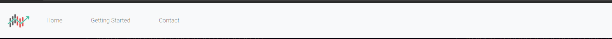
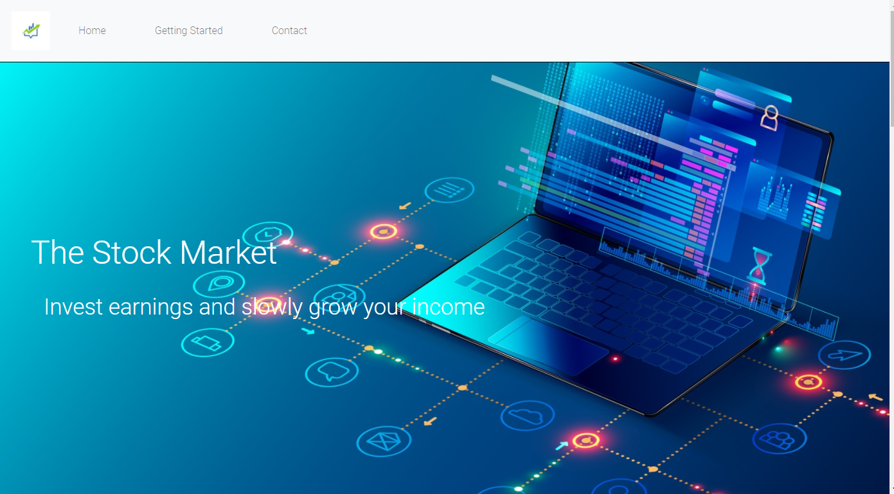

# MilestoneProject

# Overview

This project is aimed at people that are interested in getting involved with the stock market at a very beginner level. I consider it a pathway so that people that have no experience can understand the stock market and then be provided with some useful resources to be able to go away and do their own research to become confident enough to invest.

The aims of this project are to provide an introduction to what the stock market is, the different ways you can trade in the stock market and the risks involved in doing so. It will also have links to several resources and helpful information so that further reading can be completed outside of the scope of difficulty this website aims for.

# UX

### Project Goals

The project goals are to teach people who are beginners in the stock market the basic information needed to understand and research the ways they can invest into it.

### User Goals

Users will gain a basic understanding of the safest way to invest and get a few pointers towards resources and websites that will help them learn stocks.

If the user is already well informed about the stock market, the website could be offered to advertise any product the user offers if it brings benefit to the website, developer and user.

### Developer Goals

A business focus for the website in the future could be to sell or advertise other products or my own, that teach and inform people about the stock market. These could be linked and advertised inside the website.

As for now the developer goals. They are to pass on basic understanding and knowledge in the least confusing way possible to make the user interesting in the stock market.

### User stories

As the website owner:

* Convey information in a clear and well informed style and ensure users are not confused or annoyed by page noise.

* Need to advertise websites and products well to ensure my website is attractive for people to want to advertise their products on my site.

* The website needs to be easy to navigate so that people that aren't as clued up about technology still have no problem navigating.

As a first time website user:

* Find clear and concise information on investing and be able to find follow up resources to continue research.

* Be able to contact someone in the event that a question is present which the website does not answer.

* Find links to social media to connect with other people that are also intersted about investing.

As a returning user:

* Revisit information easily and be able to find resources without having to renavigate through a lot of irrelevant material.

* Ask a question or connect over social media, maybe for more resources or more advice regarding further learning.

## Structure

Using bootstrap the website is designed to be functional on all devices. This allows users to access information wherever they are and whenever they have downtime. This will make the website more accessible. Also this design is to increase user satisfaction over all devices which will increase the amount of people the website reaches.

## Wireframes

# Features

### Navigation bar

The Navigation bar is simple and easy to use, and remains the same on each page to allow for easy navigation of the 3 pages; Home, getting started and contact. It will stick to the top to allow for navigation whenever the user needs it.

It also folds in at a certain width, to allow for functionality on smaller on devices.

This was achieved by bootstrap v4.6. Large amounts of the nav bar were produced using this library.

## Landing Page

The landing page was designed using my judgement on how modern websites look today. I tried to tailor the website to look visually inviting and remain clutter free, so that the information was easy to follow.

* My main focus during this project was to keep the website looking very clean and spacious. As I think this is the best way to convey information.

* The background image keeps things simple, and goes well alongside some text that clearly defines the websites goal, to get you into investing.

## The Main Content

The main content is laid out using bootstraps grid system. I used this as I thought it was the easiest way to structure a website that is trying to teach a user something. This also keeps the website fully responsive when it is scaled down and allows for structure when viewed on smaller devices.

* The content is also laid out with thought in how the foreground and background interact. Opposing colours are used so that text is never hard to read, keeping the website user friendly.

## Getting Started

A short section taking the user through the considerations if they want to start investing soon.

* The library will also allow users to discover useful books, and research famous investors. This encourages further reading for the user.

## Contact me

A simple form to allow users to ask a question if they need to. This allows people to question the wesbsite, information, any concerns or praise about the site directly.

## The Footer

The footer is simple and easy, with 4 links to my social media and some text inviting a user to learn more about me. This allows people to connect to me socially of they feel like they want to.

## Future ideas

* Advertise products specifically.

* Give more detailed information for users that feel like they want to learn more.

* A discussions page to allow users to comunicate and connect wth each other.

## Technologies used

#### HTML5 

 As the main language for structure.

#### CSS

For styling

#### Bootstrap

Bootstrap v4.6 

* Css framework for mobile responsiveness.
* Some JS involved as I also used bootstrasp for a responsive navigation bar.

#### Google Fonts

To select my main font.

#### Fontawesome

Use of variuos icons throughout the project.

#### Git

Used for verion control

#### Gitpod

Used as a workspace and hosting platform

#### Github

To host and store my project remotely.

# Testing

## Validator Testing

HTML

* * No errors found when HTML code passed through the https://validator.w3.org/

CSS

* * No errors found when CSS code passed through the https://jigsaw.w3.org/

### Unfixed bugs

Unsure how to scale the landing page down without too much interference on landing page on mobile devices so a brief gap between "hero text" and "Why invest" is a minor visual issue.

## Deployment

This project was deployed on github pages. I used gitpod as my developer environment and committed often to ensure good version control. Git push allowed me to save changes to gihthub.

Steps to deploying project on github pages:

1. Navigate to settings on desired repository.
2. Scroll down to the github pages section near the bottom.
3. Select the main branch, and the root directory.
4. Save and github pages will deploy the site. 

Your site is published at https://danb1998.github.io/MilestoneProject/

You can also run the repository locally.

1. Navigate to the repository and download.
2. Download the zip file containing the code.
3. Extract the file and use in an appropriate environment.

## Credits