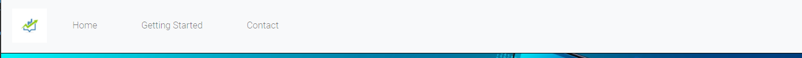

# MilestoneProject

# Overview

This project is aimed at people that are interested in getting involved with the stock market at a very beginner level. I consider it a pathway so that people that have no experience can understand the stock market and then be provided with some useful resources to be able to go away and do their own research to become confident enough to invest.

The aims of this project are to provide an introduction to what the stock market is, the different ways you can trade in the stock market and the risks involved in doing so. It will also have links to several resources and helpful information so that further reading can be completed outside of the scope of difficulty this website aims for.

# UX

### Project Goals

The project goals are to teach people who are beginners in the stock market the basic information needed to understand and research the ways they can invest into it.

### User Goals

Users will gain a basic understanding of the safest way to invest and get a few pointers towards resources and websites that will help them learn stocks.

### Developer Goals

A business focus for the website in the future could be to sell or advertise other products or my own, that teach and inform people about the stock market. These could be linked and advertised inside the website.

As for now the developer goals. They are to pass on basic understanding and knowledge in the least confusing way possible to make the user interesting in the stock market.

# Features

### Navigation bar

The Navigation bar is simple and easy to use, and remains the same on each page to allow for easy navigation of the 3 pages; Home, getting started and contact.

It also folds in at a certain width, to allow for functionality on smaller on devices.

This was achieved by bootstrap v4.6. Large amounts of the nav bar were produced using this library.

## Landing Page

The landing page was designed using my judgement on how modern websites look today. I tried to tailor the website to look visually inviting and remain clutter free, so that the information was easy to follow.

* My main focus during this project was to keep the website looking very clean and spacious. As I think this is the best way to convey information.

* The background image keeps things simple, and goes well alongside some text that clearly defines the websites goal, to get you into investing.

## The main content

The main content is laid out using bootstraps grid system. I used this as I thought it was the easiest way to structure a website that is trying to teach a user something. This also keeps the website fully responsive when it is scaled down and allows for structure when viewed on smaller devices.

* The content is also laid out with thought in how the foreground and background interact. Opposing colours are used so that text is never hard to read, keeping the website user friendly.

## The Footer

The footer is simple and easy, with 4 links to my social media and some text inviting a user to learn more about me.

# Testing

## Validator Testing

HTML

* * No errors found when HTML code passed through the https://validator.w3.org/

CSS

* * No errors found when CSS code passed through the https://jigsaw.w3.org/

### Unfixed bugs

Unsure how to scale the landing page down without too much interference on landing page on mobile devices so a brief gap between "hero text" and "Why invest" is a minor visual issue.